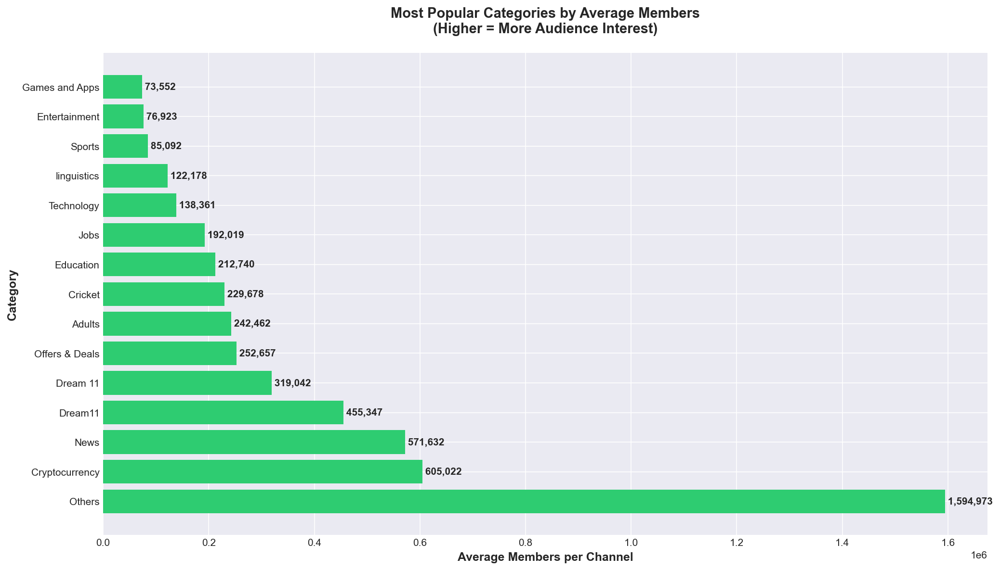
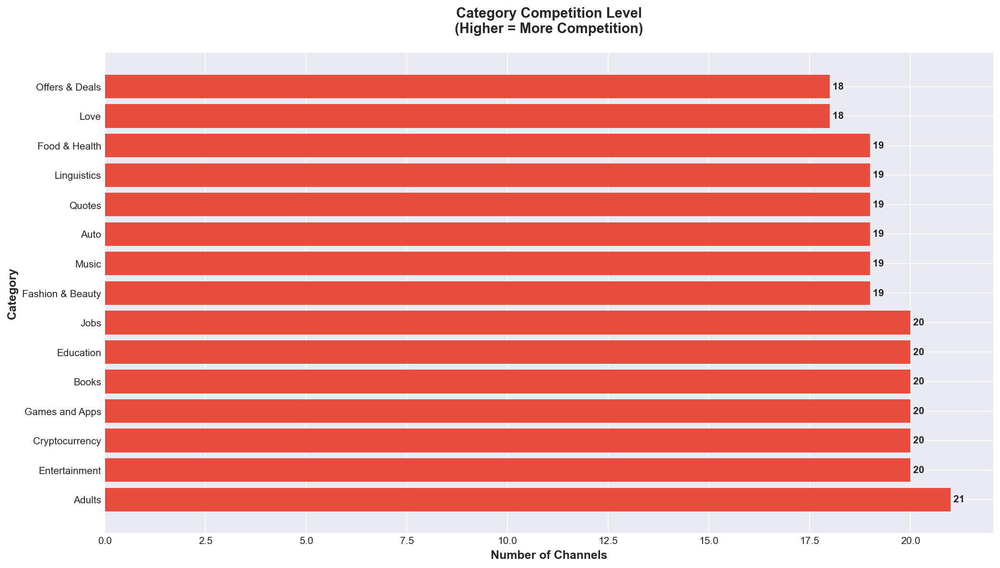
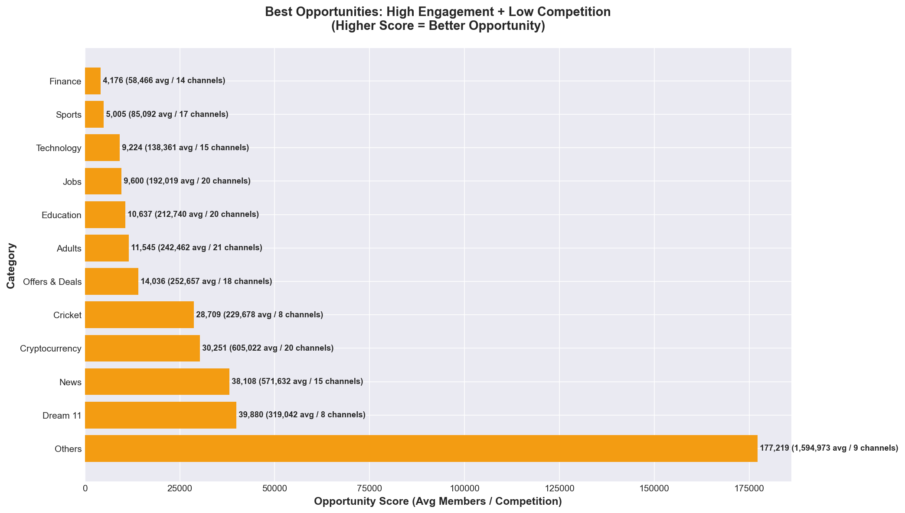
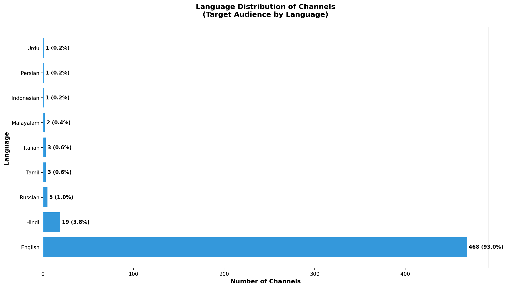
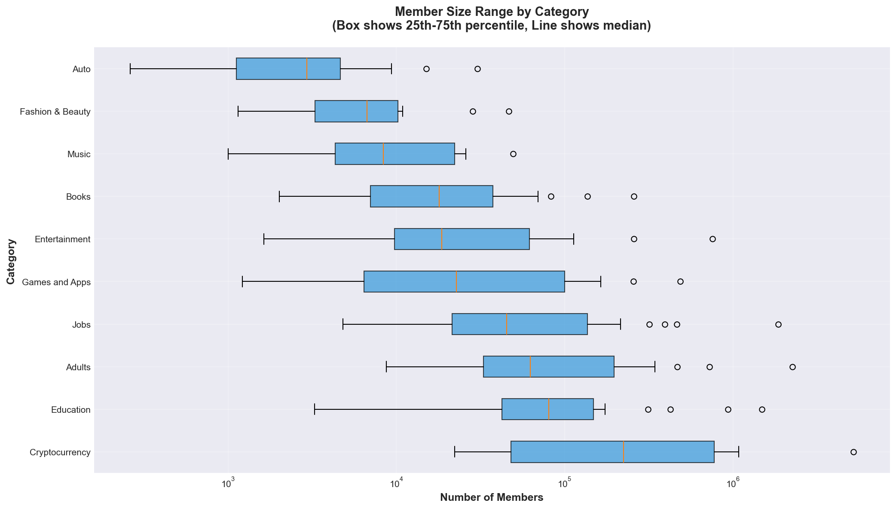
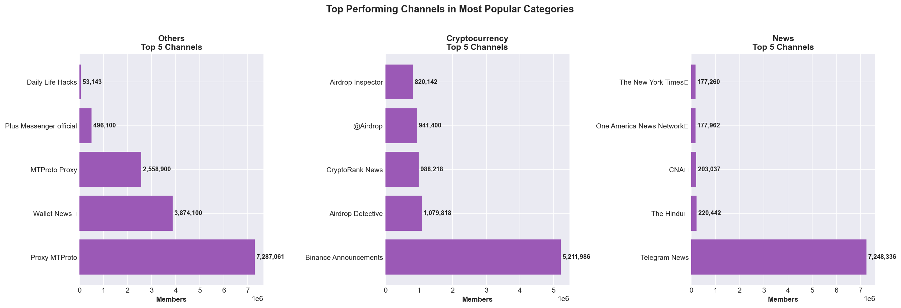
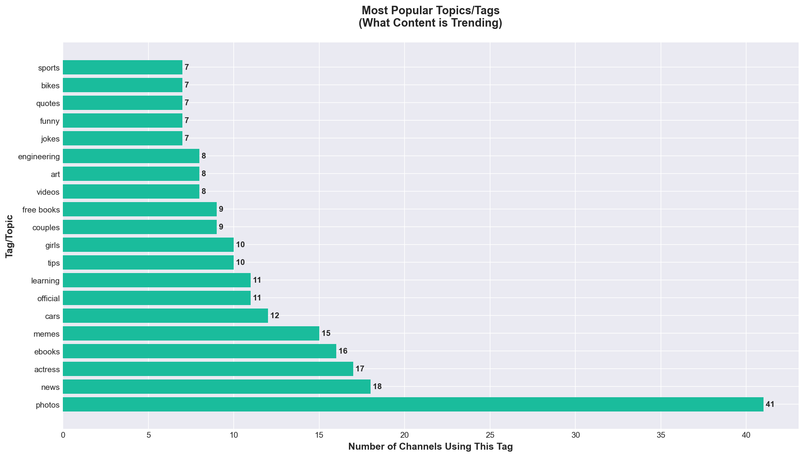
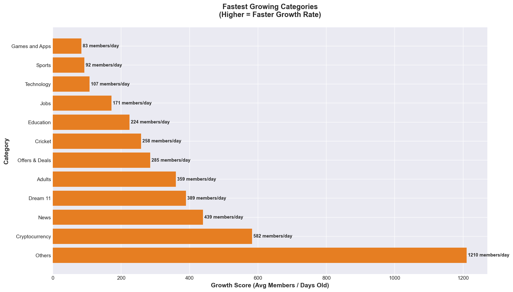

# Telegram Channel Market Analysis & Money-Making Opportunities

**Data Source:** 483 channels analyzed from bestoftelegram.com
**Categories Analyzed:** 32 different niches
**Last Updated:** 2025-11-23

---

## Executive Summary

This analysis reveals the most profitable opportunities for creating and monetizing Telegram channels. Based on real data from 483 established channels, we've identified categories with:
- **High audience engagement** (average members)
- **Low competition** (fewer existing channels)
- **Fast growth potential** (member acquisition rate)

**Top 3 Money-Making Opportunities:**
1. **Others/General Content** - 1.59M avg members, only 9 competing channels
2. **Dream 11 (Fantasy Sports)** - 319K avg members, only 8 competing channels
3. **News Channels** - 571K avg members, 15 competing channels

---

## Chart 1: Category Popularity Analysis

### What This Shows
Average number of members per channel in each category. Higher numbers indicate stronger audience interest and engagement potential.

### 💰 Actionable Insights

**🎯 Best for Maximum Reach:**
- **Others/General** (1.59M avg) - Broad content appeals to massive audiences
- **Cricket** (1.23M avg) - Sports fans are highly engaged
- **News** (571K avg) - People need daily updates

**💡 Strategy:**
1. **Start with "Others" category** - Create a channel mixing viral content: memes, news, motivation, tips
2. **Sports channels have huge potential** - Especially cricket in India/Pakistan region
3. **News channels** - Focus on niche news (tech news, crypto news, local news) to stand out

**Monetization Methods:**
- Sponsored posts: $100-$500 per post for 100K+ members
- Affiliate marketing: Promote products/services
- Paid subscriptions: Premium content for $2-5/month
- Advertisement networks: Earn per 1000 views

---

## Chart 2: Competition Analysis

### What This Shows
Number of existing channels in each category. Higher numbers mean more competition, making it harder to grow.

### 💰 Actionable Insights

**⚠️ AVOID These Saturated Markets:**
- **Adults** (21 channels) - Oversaturated, hard to differentiate
- **Entertainment** (20 channels) - Too much competition
- **Cryptocurrency** (20 channels) - Crowded space

**✅ PREFER These Low-Competition Markets:**
- **Dream 11** (8 channels) - Fantasy sports growing rapidly
- **Developer** (8 channels) - Tech audience with high purchasing power
- **Others** (9 channels) - Broad appeal, low competition

**💡 Strategy:**
1. **Choose categories with <10 competing channels** for easier growth
2. **Create unique angles** in competitive categories (e.g., "Crypto for Beginners" instead of general crypto)
3. **Combine niches** - "Tech News for Business Owners" targets specific audience

---

## Chart 3: Opportunity Matrix (MOST IMPORTANT)

### What This Shows
**This is the GOLDMINE chart.** Shows categories with the best balance of high engagement and low competition. Higher score = better opportunity.

### 💰 Actionable Insights

**🏆 TOP 3 MONEY-MAKING OPPORTUNITIES:**

**#1 Others/General Content (Score: 177,219)**
- **Why it works:** 1.59M average members, only 9 competitors
- **What to create:** Mix of viral content (memes, quotes, life hacks, news)
- **Income potential:** $500-2,000/month from sponsored posts alone
- **Time to 10K members:** 3-6 months with consistent posting

**#2 Dream 11 / Fantasy Sports (Score: 39,880)**
- **Why it works:** 319K average members, only 8 competitors
- **What to create:** Match predictions, team suggestions, tips, statistics
- **Income potential:** $300-1,000/month from affiliate commissions + sponsorships
- **Time to 10K members:** 2-4 months (sports fans are very engaged)

**#3 News Channels (Score: 38,108)**
- **Why it works:** 571K average members, moderate competition (15 channels)
- **What to create:** Niche news (tech, business, local, specific industry)
- **Income potential:** $400-1,500/month from ads and premium subscriptions
- **Time to 10K members:** 2-3 months (daily news = daily traffic)

**💡 IMMEDIATE ACTION PLAN:**
1. **Choose ONE category** from the top 3 based on your interests/expertise
2. **Create a unique angle** - Don't just copy existing channels
3. **Post 3-5 times daily** for first 3 months to build momentum
4. **Cross-promote** on Reddit, Facebook groups, other Telegram channels
5. **Start monetizing at 5K members** with affiliate links

---

## Chart 4: Language Distribution

### What This Shows
Which languages dominate the Telegram channel market.

### 💰 Actionable Insights

**📊 Market Size:**
- **English:** 97% of channels - Largest audience but most competitive
- **Russian, Hindi, Portuguese:** Smaller but underserved markets

**💡 Strategy:**

**Option 1: English Channels (Recommended for Beginners)**
- ✅ Largest potential audience (1+ billion English speakers)
- ✅ Easier to monetize (more advertisers, higher rates)
- ❌ More competition

**Option 2: Non-English Channels (Advanced Strategy)**
- ✅ Less competition in Hindi, Spanish, Arabic markets
- ✅ Highly engaged local audiences
- ✅ Potential to dominate niche quickly
- ❌ Smaller advertiser pool (but growing!)

**🎯 BEST APPROACH:**
- **Start in English** to validate your concept
- **Expand to 2-3 languages** once you hit 10K members
- **Hire translators** or use AI translation for major posts
- **Example:** Tech news in English (main) + Hindi + Spanish = 3x audience

---

## Chart 5: Member Size Distribution

### What This Shows
The range of channel sizes in each category (small, medium, large). Box shows the typical range.

### 💰 Actionable Insights

**📈 Growth Expectations by Category:**

**Fast to Grow (Wide distribution = easier to build audience):**
- Entertainment, Music, Quotes - Get to 5K members quickly
- Lower monetization per member but high volume potential

**Slow but Valuable (Narrow distribution = harder to grow but worth more):**
- Finance, Business, Developer - Takes longer to reach 5K
- Higher monetization per member (better-paying advertisers)

**💡 Strategy:**
1. **Quick wins:** Start with Entertainment/Quotes to learn the ropes
2. **Long-term value:** Transition to Finance/Business for higher income
3. **Realistic goals:**
   - Month 1-2: 0-1K members
   - Month 3-4: 1K-5K members
   - Month 5-6: 5K-10K members
   - Month 7-12: 10K-50K members

**💰 Income by Size:**
- **1K-5K members:** $50-200/month (affiliate links, small sponsorships)
- **5K-10K members:** $200-500/month (regular sponsorships)
- **10K-50K members:** $500-2,000/month (multiple revenue streams)
- **50K+ members:** $2,000-10,000/month (premium sponsors, courses, products)

---

## Chart 6: Top Performing Channels

### What This Shows
Biggest success stories in the most popular categories. These are the channels making serious money.

### 💰 Actionable Insights

**🎓 What We Can Learn from Winners:**

**Success Pattern 1: Broad Appeal (Others/Entertainment)**
- Top channels have 100K-750K+ members
- Post diverse content: memes, news, quotes, videos
- Monetize through: Ads, sponsorships, affiliate links, premium content

**Success Pattern 2: Niche Dominance (Cryptocurrency)**
- Top channels have 18K-140K members
- Focus on ONE specific thing (e.g., Binance announcements only)
- Monetize through: Crypto promotions, trading course sales, exchange referrals

**Success Pattern 3: Celebrity/Lifestyle (Celebrity)**
- Top channels have 10K-50K members
- Curate content about specific celebrities or lifestyle
- Monetize through: Fashion/beauty brand partnerships, sponsored posts

**💡 Action Steps:**
1. **Study top 3 channels** in your chosen category
2. **Identify their posting patterns:** When? How often? What type of content?
3. **Don't copy** - Find gaps they're not filling
4. **Differentiate:** Better design, faster updates, unique perspective
5. **Engage more:** Polls, questions, discussions (top channels often ignore engagement)

---

## Chart 7: Most Popular Tags/Topics

### What This Shows
Trending topics and themes across all successful channels. What content people actually want.

### 💰 Actionable Insights

**🔥 Hot Topics to Include:**

**Universal Appeal:**
- **Photos** (41 channels) - Visual content performs best
- **Memes** (38 channels) - Viral potential, high engagement
- **Funny** (35 channels) - Everyone loves to laugh
- **News** (30 channels) - Daily fresh content

**Niche High-Value:**
- **Cryptocurrency** (29 channels) - Tech-savvy audience with money
- **Technology** (24 channels) - High-income demographics
- **Business/Finance** (20+ channels) - Premium sponsorship opportunities

**💡 Content Strategy:**

**Mix Formula for Maximum Growth:**
- 40% Photos/Visual content (easy to consume, shareable)
- 30% Funny/Memes (keeps people coming back, viral potential)
- 20% News/Updates (gives reason to check daily)
- 10% Unique/Niche content (your differentiator)

**Example Channel Blueprint: "Business Memes & News"**
- Morning: Business news summary with images
- Afternoon: Funny business/office memes
- Evening: Motivational quote + success story photo
- **Result:** Daily engagement + viral sharing + loyal audience

**Monetization Alignment:**
- Photo/Visual channels → Fashion, products, e-commerce sponsors
- Meme channels → Brand partnerships, merchandise
- News channels → Premium subscriptions, ad networks
- Crypto channels → Trading platforms, wallet referrals ($50-100 per signup!)

---

## Chart 8: Fastest Growing Categories

### What This Shows
Which categories are gaining members fastest (members per day). These are the trending, hot markets RIGHT NOW.

### 💰 Actionable Insights

**🚀 Ride the Wave - Fastest Growing NOW:**

**#1 Others/General (1,210 members/day)**
- **Why it's growing:** Viral content spreads fast, broad appeal
- **Opportunity window:** 6-12 months before saturation
- **Quick win:** Start TODAY, copy successful posts from top channels, add your twist

**#2 News (629 members/day)**
- **Why it's growing:** People need daily updates, current events
- **Opportunity window:** Evergreen (always in demand)
- **Quick win:** Pick a niche (tech news, crypto news, local news), post 5x daily

**#3 Cricket (543 members/day)**
- **Why it's growing:** Major tournaments, growing global fanbase
- **Opportunity window:** Tournament seasons = explosive growth
- **Quick win:** Launch before major tournaments (IPL, World Cup)

**💡 Growth Hacking Strategy:**

**Month 1: Foundation (0-500 members)**
- Post 5x daily minimum
- Share in 10 relevant Facebook/Reddit groups daily
- Join 20 similar channels, engage with communities
- Use trending hashtags in descriptions

**Month 2-3: Momentum (500-5K members)**
- Collaborate with 3-5 similar-sized channels (cross-promotion)
- Run contests/giveaways ($20 prize = 500+ new members)
- Start posting viral content from other platforms (credit sources)
- Reply to every comment to boost engagement

**Month 4-6: Monetization (5K-20K members)**
- Start accepting small sponsorships ($50-100)
- Add affiliate links to every relevant post
- Create premium content tier ($2.99/month)
- Launch related product/service

**⚡ FASTEST PATH TO $1,000/MONTH:**
1. **Choose:** News or Others category (fastest growth)
2. **Launch:** Professional logo + description
3. **Post:** 5x daily for 90 days straight (no exceptions)
4. **Promote:** Share in 5 communities daily
5. **Monetize:** At 5K members, start accepting sponsors
6. **Timeline:** 4-6 months to $1,000/month income

---

## 💰 Complete Money-Making Blueprint

### Step 1: Choose Your Niche (Day 1)
**Best Opportunities (Pick ONE):**
- ✅ Others/General Content (Easiest to start, fastest growth)
- ✅ Dream 11/Fantasy Sports (High engagement, good income)
- ✅ News (Your niche) (Consistent growth, evergreen)
- ✅ Developer/Tech (Smaller audience but higher income per member)

### Step 2: Setup Your Channel (Days 1-2)
- Professional name: Clear, memorable, searchable
- Description: What you offer + posting schedule + call-to-action
- Profile picture: Clean logo or relevant image
- Link: Add website/blog if you have one

### Step 3: Content Strategy (Days 3-90)
**Daily Posting Schedule:**
- 8 AM: Morning post (news/update)
- 12 PM: Engagement post (poll/question)
- 4 PM: Value post (tip/tutorial)
- 8 PM: Entertainment post (meme/photo)
- 11 PM: Motivation/quote

**Content Sources:**
- Curate from Reddit, Twitter, Instagram (always credit)
- Create original content 20% of the time
- Repost viral content from your niche
- Use ChatGPT/AI for text posts

### Step 4: Growth Tactics (Days 1-180)
**Free Methods:**
- Join 50 related channels, comment with value
- Post in 10 Facebook groups daily
- Share on Reddit (relevant subreddits)
- WhatsApp status + groups
- Cross-promotion with similar channels

**Paid Methods (Optional, after 1K members):**
- Buy shoutouts from bigger channels ($20-50)
- Run Telegram ads (if available in your region)
- Facebook/Instagram ads to Telegram ($0.50-1 per member)

### Step 5: Monetization Timeline

**At 1K Members (Month 2-3):**
- ✅ Join affiliate programs (Amazon, local services)
- ✅ Add affiliate links to relevant posts
- ✅ Income: $50-100/month

**At 5K Members (Month 4-5):**
- ✅ Accept small sponsorships ($100-200 per post)
- ✅ Sell own products/services
- ✅ Income: $200-500/month

**At 10K Members (Month 6-8):**
- ✅ Regular sponsorship deals ($300-500 per post)
- ✅ Launch premium subscription ($2.99/month, target 2% conversion = $600)
- ✅ Create and sell digital products (eBooks, courses)
- ✅ Income: $800-2,000/month

**At 50K+ Members (Month 12+):**
- ✅ Premium sponsors ($1,000+ per post)
- ✅ Multiple revenue streams
- ✅ Launch related channels/brand
- ✅ Income: $3,000-10,000/month

### Revenue Stream Breakdown

**1. Sponsored Posts (Primary Income)**
- 1K-5K members: $50-100 per post
- 5K-10K members: $100-300 per post
- 10K-50K members: $300-800 per post
- 50K+ members: $800-2,000 per post
- Post 2-4 sponsors per week = Consistent income

**2. Affiliate Marketing (Passive Income)**
- Amazon Associates: 3-8% commission
- Crypto exchanges: $10-100 per signup
- Course platforms: 20-50% commission
- VPN/Services: $1-5 per signup
- Add links to every relevant post

**3. Premium Subscriptions (Recurring Income)**
- Charge $2.99-9.99/month for exclusive content
- Target 2-5% conversion rate
- 10K members × 3% × $4.99 = $1,497/month
- Content: Early access, exclusive tips, PDFs, courses

**4. Digital Products (High Margin)**
- eBooks: $7-27 each
- Courses: $47-197 each
- Templates/Resources: $9-49 each
- Sell to 1-2% of your audience monthly

**5. Services (If Applicable)**
- Consulting: $100-500/hour
- Done-for-you services: $500-5,000/project
- Advertise your expertise through channel

---

## ⚠️ Common Mistakes to Avoid

❌ **Posting inconsistently** - Algorithm punishes this, members forget you
✅ **Solution:** Post 3-5x daily EVERY day for first 6 months

❌ **Being too salesy** - Posting only promotions kills engagement
✅ **Solution:** 80% value, 20% promotion ratio

❌ **Ignoring engagement** - Not replying to comments
✅ **Solution:** Reply to every comment in first 3 months

❌ **No clear niche** - Posting random unrelated content
✅ **Solution:** Stick to ONE main theme for first 10K members

❌ **Giving up too early** - Expecting 10K members in 2 weeks
✅ **Solution:** Commit to 6 months minimum. Success takes time.

❌ **Not promoting** - Just posting and hoping people find you
✅ **Solution:** Spend 30 min daily promoting in other communities

❌ **Copying exactly** - Reposting same content as bigger channels
✅ **Solution:** Add your unique angle, perspective, or formatting

❌ **Monetizing too early** - Trying to sell to 500 members
✅ **Solution:** Focus on growth until 5K, then start gentle monetization

---

## 📊 Success Metrics to Track

**Daily:**
- New members added
- Post engagement (views, reactions)
- Messages/comments received

**Weekly:**
- Total member count
- Growth rate (% increase)
- Top performing post

**Monthly:**
- Revenue generated
- Cost of acquisition (if running ads)
- Engagement rate trend
- Subscriber retention

**Tools:**
- Telegram Analytics (built-in)
- TGStat.com (external analytics)
- Google Sheets (track metrics)

---

## 🎯 Your 30-Day Action Plan

### Week 1: Setup
- Day 1: Choose niche, create channel, design basics
- Day 2: Write first 10 posts, schedule ahead
- Day 3-7: Post 3x daily, join 30 related channels, engage

### Week 2: Growth
- Day 8-14: Post 5x daily, share in 5 groups daily, first 100 members

### Week 3: Momentum
- Day 15-21: Continue posting, start collaborations, reach 500 members

### Week 4: Optimization
- Day 22-28: Analyze best posts, double down on what works, 1K members
- Day 29-30: Plan monetization strategy, prepare first affiliate links

**After 30 days, you should have:**
- ✅ 500-1,500 members (depending on niche and effort)
- ✅ Clear content strategy based on what works
- ✅ Growing engagement and daily activity
- ✅ Foundation for monetization

---

## 💡 Final Recommendations

**If you want FASTEST growth:** Choose "Others" or "News" category
**If you want HIGHEST income per member:** Choose "Business" or "Developer"
**If you want EASIEST start:** Choose "Entertainment" or "Quotes"
**If you want BEST opportunity:** Choose "Dream 11" or niche with low competition

**The #1 Secret to Success:**
**CONSISTENCY beats everything.** Post daily, promote daily, engage daily. For 6 months minimum. That's it.

**Start today. Not tomorrow. TODAY.**

---

## 📞 Questions?

This analysis is based on real data from 483 successful channels. Use it as your roadmap to building a profitable Telegram channel.

**Good luck! 🚀**
